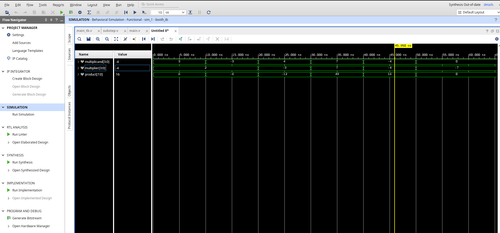
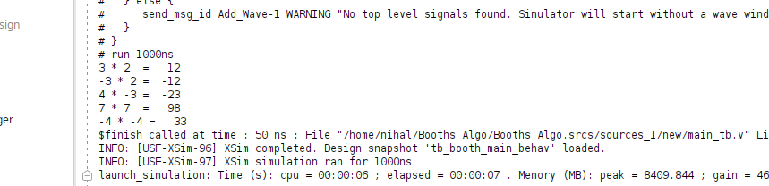

# 🧮 4-bit Signed Booth Multiplier in Verilog

This project implements a **4-bit signed multiplier** using **Booth's Algorithm**, written in Verilog HDL. 

---

### Module Overview

#### booth\_main.v (Top-Level Module)

This is the top-level module that performs 4-bit signed multiplication using Booth's algorithm. It connects four instances of the `substep` module to perform four steps of Booth's algorithm.

**Inputs:**

* `multiplicand [3:0]` – Signed 4-bit input
* `multiplier   [3:0]` – Signed 4-bit input

**Output:**

* `product      [7:0]` – Signed 8-bit output (result of multiplication)

**Function:**

* Initializes AC, QR, and Q registers
* Instantiates and connects 4 sequential `substep` modules
* After 4 steps, concatenates AC and QR to form the final product

#### substep.v (One Booth Cycle)

This module performs a single step of Booth’s algorithm. It takes in the current values of AC, QR, Q, and BR, then:

1. Determines whether to add, subtract, or do nothing based on QR\[0] and Q.
2. Updates AC by performing the required arithmetic operation.
3. Performs an arithmetic right shift on the concatenated {AC, QR, Q}.
4. Outputs the new AC, QR, and Q for the next stage.

**Inputs:**

* `ac  [3:0]` – Current accumulator
* `br  [3:0]` – Multiplicand
* `qr  [3:0]` – Current multiplier value
* `q        ` – Previous least significant bit

**Outputs:**

* `new_ac [3:0]` – Updated accumulator
* `new_qr [3:0]` – Updated multiplier
* `new_q       ` – Updated Q bit

## Simulation Waveform

## Booth's Algorithm Console log

